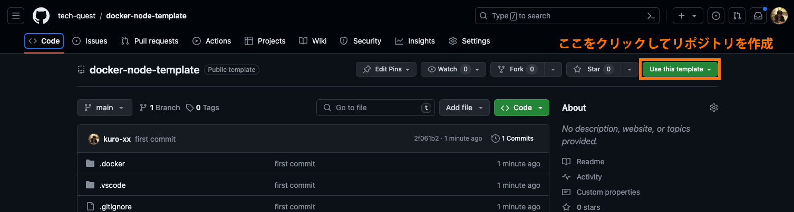

# 🐳

## 事前準備

当リポジトリでは Docker というツールを使用して自身のPC上で環境が構築されるように作成しています。  
ご自身のPCに Docker をまだインストールしていない方は以下手順でインストールをしてください。　　

※ インストール済みの方は「環境構築手順」にお進みください。

### 1. Dockerのインストール

以下サイトでインストールが行えます。  
https://www.docker.com/products/docker-desktop/

### 2. 「Docker Desktop」(3.でインストールしたソフト) を起動

Docker Desktop を起動することで Docker を利用した環境構築が行えるようになります。

## 環境構築手順

### 1. 「docker-node-template」リポジトリをテンプレートとして、自身の Github にリポジトリを作成



### 2. 作成した自身のリポジトリをローカルにcloneする

1の手順で自身の Github に当リポジトリのファイルが複製されたリポジトリが作成されます。  
作成されたリポジトリを自身のリポジトリに clone してください。

### 3. 「Dockerコンテナ」の起動

clone したディレクトリに移動し、以下のコマンドを実行して Docker コンテナを起動します。

```
cd [cloneしたディレクトリ名]
docker compose up -d
```

起動をしたら以下コマンドを実行するか、 Docker Desktop アプリでコンテナが作成されたかを確認してみましょう。

```
docker container ls
```

### 4. 作成したコンテナに接続する
以下のコマンドを実行すると作成したコンテナに接続することができます。

```
docker compose exec node bash
```

正常に接続できた場合はターミナルの表示が以下のようになります。

```
root@9962b6d42569:/var/www#
```
※ `9962b6d42569` の部分はランダムに設定されるので異なる場合があります。

上記のような表示になっているときは実行したコマンドは自身の PC 上ではなく、コンテナ上で実行されるようになります。

### 5. Node.js が正常にインストールされているかを確認する

コンテナ内に接続されている状態であることをよく確認し、以下のコマンドを実行してください。

```
root@9962b6d42569:/var/www# node --version
```

`v20.12.2` という文言が表示されれば OK です！

## よくある質問

### Q. `docker compose exec node bash` を実行したらエラーが発生してしまいます。

A. 以下のいずれかの可能性があります。

- 現在地のディレクトリが誤っている<br />
`pwd` コマンドを実行して自分が現在いるディレクトリの場所を確認してください。<br />
clone で作成したディレクトリ上でコマンドを実行する必要があるため、違うディレクトリにいる場合は移動してから実行してください。


- コンテナが起動されていない<br />
`docker container ls` コマンドを実行するか、 Docker Desktop 上でコンテナが起動しているかを確認し、<br />
コンテナが起動していない場合は `docker compose up -d` を実行して起動をしてから実行してください。

### Q. 起動したコンテナを停止させたい
`docker compose stop` コマンドで停止させることができます。<br />
実行後は正常に停止できているかを `docker container ls` コマンドを実行するか、 Docker Desktop 上で確認してください。

また、停止したコンテナは `docker compose up -d` コマンドで再度起動することができます。
